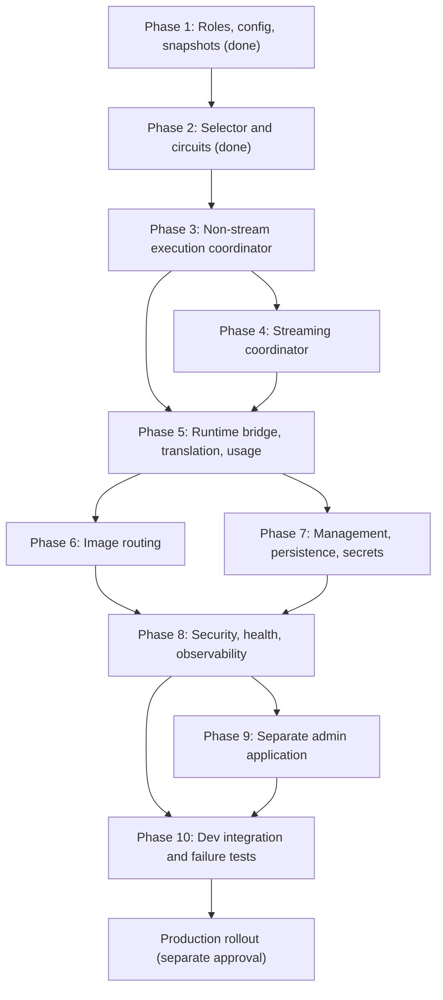

# SmartRouter v1 Agent Implementation Plan

Status: Active
Architecture source of truth: `docs/smart-router-v1.md`
Implementation repository: `/home/sanya/coding/Earn/SmartAPI/SmartCLIProxy`
Last baseline verification: 2026-07-26

## 1. Purpose

This document turns the SmartRouter specification into implementation phases
that can be handed to separate coding agents. It describes the current worktree,
phase boundaries, required interfaces, tests, and completion criteria.

The specification decides product and architecture behavior. This plan decides
implementation order. If the two documents conflict, stop and resolve the
specification instead of silently changing behavior.

## 2. Non-negotiable boundaries

- SmartAPIV2 owns public authentication, balances, billing, and public request
  history.
- SmartRouter owns upstream registration, model groups, route selection,
  route-level failover, protocol conversion, and normalized usage.
- Account pools own account credentials, OAuth refresh, quota polling,
  account-level affinity, cooldown, and account failover.
- SmartRouter must never receive or expose Codex, Grok, or OpenCode account
  credentials.
- Router, pool, and combined runtimes use one source repository and image but
  separate configuration, ports, volumes, keys, and runtime state.
- Existing `combined` behavior must remain the default.
- Production must not be changed or deployed without explicit user approval.
- Do not clean, reset, revert, or replace existing worktree changes.
- Do not add request timeouts. Follow the timeout rules in `AGENTS.md`.

## 3. Start-of-task checklist for every agent

1. Read `AGENTS.md`.
2. Read `docs/smart-router-v1.md`.
3. Read this document completely, including dependencies and exclusions.
4. Run `git status --short` and preserve all existing changes.
5. Run the focused tests for the phase before editing.
6. Inspect the existing executor and translator APIs before creating new
   abstractions.
7. Implement only one phase unless the handoff explicitly combines phases.
8. Run `gofmt`, focused tests, full tests, and the required server build.
9. Update the phase status and handoff notes in this document.
10. Do not commit, push, deploy, or modify production unless explicitly asked.

Required final verification after Go changes:

```bash
gofmt -w <changed-go-files>
go test ./...
go test -race ./internal/config ./internal/smartrouter ./sdk/api/handlers ./sdk/cliproxy
go vet ./internal/config ./internal/smartrouter ./sdk/api/handlers ./sdk/cliproxy/...
go build -o /tmp/smartcli-router-build ./cmd/server
git diff --check
```

`go vet ./...` currently has pre-existing findings in request logging, plugin
callbacks, and handlers. A phase must not add new findings to changed packages.

## 4. Current worktree

The SmartRouter work is intentionally uncommitted. The next agent must work with
it in place.

Implemented files:

- `internal/config/router_config.go`
- `internal/config/router_config_test.go`
- `internal/smartrouter/snapshot.go`
- `internal/smartrouter/snapshot_test.go`
- `internal/smartrouter/selector.go`
- `internal/smartrouter/selector_test.go`
- `internal/smartrouter/circuit.go`
- `internal/smartrouter/circuit_test.go`
- `internal/smartrouter/coordinator.go`
- `internal/smartrouter/coordinator_test.go`
- `internal/smartrouter/retry_after.go`
- `internal/smartrouter/retry_after_test.go`
- `internal/smartrouter/stream.go`
- `internal/smartrouter/stream_coordinator.go`
- `internal/smartrouter/stream_coordinator_test.go`
- `internal/smartrouter/usage.go`
- `internal/smartrouter/usage_test.go`
- `internal/smartrouter/storage.go`
- `internal/smartrouter/file_storage.go`
- `internal/smartrouter/audit.go`
- `internal/smartrouter/management.go`
- `internal/smartrouter/probe.go`
- `internal/smartrouter/storage_test.go`
- `internal/smartrouter/management_test.go`
- `internal/translator/openai/claude/responses_bridge.go`
- `internal/translator/openai/claude/responses_bridge_test.go`
- `internal/translator/openai/openai/responses/reverse_bridge.go`
- `internal/translator/openai/openai/responses/reverse_bridge_test.go`
- `sdk/api/handlers/smart_router_attempt.go`
- `sdk/api/handlers/smart_router_attempt_test.go`
- `sdk/api/handlers/smart_router_execution.go`
- `sdk/api/handlers/smart_router_execution_test.go`
- `sdk/cliproxy/router_upstream_runtime.go`
- `sdk/cliproxy/router_upstream_runtime_test.go`
- `sdk/cliproxy/router_management_runtime.go`
- `sdk/cliproxy/router_management_lifecycle_test.go`
- `sdk/cliproxy/router_probe.go`
- `sdk/cliproxy/router_probe_test.go`
- `sdk/cliproxy/router_snapshot_test.go`
- `docs/smart-router-v1.md`

Modified integration files:

- `.gitignore`
- `config.example.yaml`
- `internal/config/config.go`
- `internal/config/parse.go`
- `internal/api/server.go`
- `internal/runtime/executor/claude_executor.go`
- `internal/runtime/executor/openai_compat_executor.go`
- `internal/translator/`
- `sdk/api/handlers/handlers.go`
- `sdk/api/handlers/model_execution.go`
- `sdk/api/options.go`
- `sdk/cliproxy/auth/conductor.go`
- `sdk/cliproxy/auth/scheduler.go`
- `sdk/cliproxy/builder.go`
- `sdk/cliproxy/service.go`

Current verified behavior:

- Router roles and router configuration normalize and validate.
- Valid configuration compiles into immutable routing snapshots.
- Invalid reloads leave the previous snapshot active.
- A request plan pins one snapshot revision.
- Higher priority tiers are exhausted before backup tiers.
- Weighted round-robin and weighted affinity are implemented.
- A route is attempted at most once per request plan.
- Route circuits implement closed, open, and half-open behavior.
- Auth, rate-limit, transient, and protocol failures have separate policies.
- Only one concurrent half-open probe is admitted.
- A changed route or upstream gets a fresh circuit on snapshot reload.
- Existing request plans retain their original route configuration.
- Streaming fails over only while the downstream response is uncommitted.
- The first semantic event commits the downstream and prevents every later
  route selection.
- Router-role public text, streaming, compact, WebSocket, and count-token
  requests use SmartRouter when an enabled public model group matches.
- Combined and pool roles keep SmartRouter inactive.
- Route attempts use ephemeral runtime auth resolved from secret references;
  snapshots and public handlers never receive secret values.
- Chat Completions, Responses, and Anthropic Messages convert in every
  supported direction with explicit lossy-feature preflight.
- Canonical usage preserves known zeroes and unknown fields without charging
  failed attempts or estimating reasoning from output text.
- Router metadata uses complete-document optimistic revisions and crash-safe
  atomic file replacement.
- Upstream secrets are write-only through management, encrypted with
  AES-256-GCM, and represented in DTOs only by configured state and timestamp.
- Management mutations validate and normalize one complete document, coordinate
  secret changes, persistence, runtime activation, rollback, and masked audit.
- Authenticated management endpoints expose schema-driven upstream/model CRUD,
  runtime state, circuit reset, and non-inference HTTP health probes.
- Router metadata survives restart and cannot be overwritten by an ordinary
  YAML watcher reload.
- No production or development deployment was performed for these phases.

Phase 8 security, health, and observability:

- Router role rejects configured local account/API-key sources, enabled
  credential plugins, preloaded runtime credentials, and credential JSON files.
- Router role skips local credential loading, auth refresh, and watcher auth
  updates; credential/OAuth management routes are hidden.
- Internal affinity forwarding requires an explicitly trusted pool upstream.
- Router network policy protects public/private targets, runtime DNS answers,
  HTTP opt-in, and allowlisted cross-origin redirects.
- Inference and management keys must differ in router role.
- Background HTTP health polling keeps transport health separate from
  auth/rate-limit circuits and requires configured recovery thresholds.
- Bounded in-memory metrics expose requests, attempts, failovers, status
  classes, circuit transitions, latency, TTFT, usage gaps, partial stream
  failures, and ambiguous image failures.
- Stable internal diagnostic headers contain request, route, upstream, and
  attempt IDs only.

## 5. Dependency graph



Phases 4 and the early storage portion of Phase 7 may be developed in parallel
after Phase 3 contracts are stable. Their integration tests remain sequential.

## 6. Phase status

| Phase | Status | Required predecessor | Primary result |
| --- | --- | --- | --- |
| 1 | Done | None | Roles, validated config, immutable snapshots |
| 2 | Done | 1 | Request plans, weighted selection, circuits |
| 3 | Done | 2 | Non-stream route attempts and safe failover |
| 4 | Done | 3 | Commit-aware streaming failover |
| 5 | Done | 3, 4 | Existing runtime bridge, conversion, usage |
| 6 | Done | 5 | Safe image generation routing |
| 7 | Done | 5 | Management API, revisions, encrypted secrets |
| 8 | Done | 6, 7 | Security, health, metrics, diagnostics |
| 9 | Done | 7, 8 | `admin.smartapi.shop` |
| 10 | Pending | 8, optionally 9 | Dev deployment and integration evidence |
| 11 | Blocked on approval | 10 | Separately approved production migration |

## 7. Phase 1: Roles, configuration, and snapshots

Status: Done

Delivered:

- `combined`, `router`, and `pool` roles.
- `pool-kind` validation.
- Upstream, model-group, route, selection, capability, health, and auth config.
- Strict IDs, URLs, headers, protocols, capabilities, weights, references, and
  defaults.
- Immutable compiled snapshots and atomic snapshot store.
- Builder initialization and hot-reload rollback.

Do not reopen this phase to redesign field names. Additive validation fixes are
allowed when required by a later phase.

## 8. Phase 2: Selector and circuit breaker

Status: Done

Delivered:

- Request-scoped plan pinned to one snapshot revision.
- Highest-available priority tier selection.
- Weighted round-robin and deterministic weighted affinity.
- No repeated route in one plan.
- Thread-safe circuit state separate from configuration.
- Closed, open, and single-probe half-open transitions.
- `401/403`, `429`, transient, protocol, client, and cancellation categories.
- Retry-After cooldown and capped exponential transient cooldown.
- Circuit reconciliation across snapshot reload.

Do not move account selection into these types. A selected route identifies an
upstream service, never an upstream account.

## 9. Phase 3: Non-stream execution coordinator

Status: Done

Delivered:

- `Coordinator` in `internal/smartrouter/coordinator.go` executing one
  `RequestPlan` route by route through the injected `AttemptExecutor`
  interface, with `AttemptRequest`/`AttemptResponse` DTOs (the name
  `AttemptResult` was already taken by the circuit layer).
- Endpoint and stream-mode validation before the first `Next()` call, plus
  `ExecutionPolicyFor(capability, stream)`; only the text non-stream policy
  exists so far, streaming/image combinations return
  `ErrExecutionPolicyUnavailable`.
- Full text non-stream retry matrix, including malformed-2xx protocol failures
  capped at one protocol failover and terminal handling for every unlisted
  status.
- `ParseRetryAfter` in `internal/smartrouter/retry_after.go` for delta-seconds
  and HTTP-date forms.
- Client cancellation takes precedence over executor results; an admitted but
  never-executed selection is abandoned (probe released), so every selection
  gets exactly one `Report` or `Abandon`.
- Sanitized `ExecutionResult`/`AttemptRecord`/`ExecutionError` diagnostics:
  IDs, status codes, and failure categories only — no headers, bodies, or
  error snippets. The successful upstream response is returned separately as a
  defensive copy.

Handoff notes for Phase 4/5: the coordinator is wired to nothing yet; build the
streaming policy as a new `ExecutionPolicyFor` branch and inject a real
executor from the runtime bridge without moving credentials into
`internal/smartrouter`.

### 9.1 Goal

Add a protocol-neutral coordinator that consumes `RequestPlan`, executes one
route at a time through a narrow attempt interface, classifies results, records
the circuit outcome, and safely continues or returns.

This phase uses fake attempt executors in tests. It does not yet wire public HTTP
handlers or real credentials.

### 9.2 Required design

Keep `internal/smartrouter` free of Gin and concrete provider executors. Add a
narrow interface similar to:

```go
type AttemptExecutor interface {
    ExecuteAttempt(context.Context, AttemptRequest) (AttemptResponse, error)
}

type AttemptRequest struct {
    Selection     Selection
    EntryProtocol config.RouterProtocol
    Endpoint      string
    Body          []byte
    Headers       http.Header
    Query         url.Values
}

type AttemptResponse struct {
    StatusCode int
    Headers    http.Header
    Body       []byte
}
```

The exact package split may differ to avoid dependency cycles. The invariants
are more important than these example names:

- Selection remains owned by `internal/smartrouter`.
- HTTP/provider execution is injected through an interface.
- The coordinator does not know account IDs or credentials.
- Request, response, and headers are defensively copied where ownership crosses
  goroutines or attempt boundaries.
- Error values retain status and retry metadata without retaining raw sensitive
  bodies in diagnostics.

### 9.3 Work items

1. Add endpoint and request-mode validation before the first route selection.
2. Add an `ExecutionPolicy` selected by capability and stream mode.
3. Begin one request plan from public model and internal affinity fingerprint.
4. Execute the selected route with its explicit `upstream-model`.
5. Parse `Retry-After` as delta seconds or HTTP date.
6. Classify transport, HTTP, malformed-success, cancellation, and success
   results.
7. Call `RequestPlan.Report` exactly once for each completed selection.
8. Call `RequestPlan.Abandon` if an admitted attempt is never executed.
9. Continue only when the text non-stream retry matrix permits it.
10. Return the last safe upstream error when all routes are exhausted.
11. Emit an internal result object containing request ID, snapshot revision,
    route ID, upstream ID, attempts, final status, and failure categories.
12. Never include raw Authorization, cookies, secret values, or unredacted
    upstream bodies in that result.

### 9.4 Retry rules

- `2xx` with a valid body: success, no next route.
- `400`, `404`, `409`, `422`: terminal client result, no circuit change.
- `401`, `403`: record auth failure and try the next route.
- `408`, connection failure before headers, and `500/502/503/504`: record
  transient failure and try the next route.
- Other HTTP statuses are terminal unless the specification is explicitly
  amended.
- `429`: record rate-limit failure with Retry-After and try the next route.
- Malformed `2xx`: record protocol failure and allow at most one protocol
  failover.
- Client cancellation: stop immediately and do not alter a closed circuit.
- A selected route must never be executed twice.

### 9.5 Suggested files

- `internal/smartrouter/coordinator.go`
- `internal/smartrouter/coordinator_test.go`
- `internal/smartrouter/retry_after.go`
- `internal/smartrouter/retry_after_test.go`

If `net/http` ownership makes the domain package too broad, put transport DTOs
under `sdk/api/handlers` and keep policy/classification in
`internal/smartrouter`.

### 9.6 Tests

- Every status in the non-stream retry matrix.
- Primary success performs one attempt.
- Primary auth/rate/transient failure selects another route.
- Client error and cancellation never select another route.
- Malformed success retries at most once.
- No route is attempted twice.
- Retry-After delta and HTTP-date parsing.
- Final error contains safe diagnostics but no raw body or headers.
- Pinned snapshot survives a concurrent selector snapshot swap.
- Race test with concurrent requests and circuit transitions.

### 9.7 Completion criteria

- Focused tests and race tests pass.
- No public handler behavior changes.
- The coordinator is usable with a fake executor without config or global
  registries.
- Attempt ownership guarantees exactly one report or abandon operation.

### 9.8 Explicit exclusions

- Streaming.
- Image generation.
- Real provider/auth registration.
- Protocol translation changes.
- Usage normalization.
- Management endpoints.

## 10. Phase 4: Streaming coordinator

Status: Done

Delivered:

- `StreamCoordinator` in `internal/smartrouter/stream_coordinator.go` executing
  one `RequestPlan` route by route through the injected
  `StreamAttemptExecutor` interface, reusing the Phase 3 `AttemptRequest` DTO.
- `StreamAttempt` exposes the initial status and headers separately from a
  `StreamChunk` channel, so a non-2xx or connect failure fails over before any
  downstream byte is written.
- `StreamSink` (`Commit`/`Send`/`Fail`) is the downstream boundary. `Commit` is
  called at most once per request and always before the first `Send`; a request
  that never commits never touches the sink and reports through the returned
  `*ExecutionError` instead.
- `StreamState` values (`not_started`, `headers_received`, `uncommitted`,
  `committed`, `completed`, `failed_partial`) are reported in
  `StreamExecutionResult` alongside the Phase 3 sanitized diagnostics.
- Semantic-event detectors for Chat Completions, Responses, and Anthropic
  Messages in `internal/smartrouter/stream.go`. SSE comments, keepalives,
  blank lines, `event:`/`id:`/`retry:` fields, `[DONE]`, and Anthropic `ping`
  are non-committing; an `error` payload or invalid JSON is a protocol failure.
- `streamPrelude` accumulates uncommitted bytes and classifies complete SSE
  events plus complete bare JSON values at chunk boundaries or EOF, so an event
  split across chunks is never misread as malformed. It prunes completed
  non-semantic events at each SSE boundary and treats an unbounded single event
  (>1 MiB) as a protocol failure.
- `ExecutionPolicyFor` now returns the text policy for both stream modes.
  `Coordinator.Execute` rejects streaming requests with `ErrStreamModeMismatch`
  and the status matrix lives once in `ExecutionPolicy.classifyStatus`.
- Each attempt runs under its own cancellable context and cancels before
  calling `Close`, so an abandoned upstream reader is always released and no
  attempt can deadlock against an executor that drains its own goroutine.

Handoff notes for Phase 5: no timers were introduced anywhere in the stream
path; upstream completion is the closed chunk channel only. Build the runtime
bridge as a `StreamAttemptExecutor` implementation and a `StreamSink` backed by
the Gin response writer, keeping credentials out of `internal/smartrouter`.

### 10.1 Goal

Extend the execution coordinator with failover before downstream commitment and
strictly prohibit failover after the first semantic event.

### 10.2 Required design

Use a stream attempt abstraction that exposes initial status/headers separately
from chunks. Track these states:

- `not_started`
- `headers_received`
- `uncommitted`
- `committed`
- `completed`
- `failed_partial`

The downstream is committed only by a semantic protocol event or content byte.
SSE comments, blank lines, and keepalives do not commit.

Do not add a new upstream read timeout.

### 10.3 Work items

1. Add stream attempt and chunk DTOs with explicit terminal errors.
2. Buffer only the minimum data needed to decide whether an event is semantic.
3. Add semantic-event detectors for OpenAI Chat Completions, Responses, and
   Anthropic Messages.
4. Allow another route on non-2xx, connect failure, or malformed stream before
   commitment.
5. After commitment, forward all valid chunks without selecting another route.
6. On a post-commit error, emit the nearest public protocol error and mark a
   partial failure.
7. Preserve one snapshot and one public model across all attempts.
8. Ensure cancellation closes upstream work and channels without leaking
   goroutines.
9. Ensure each attempt is reported or abandoned once.

### 10.4 Tests

- Non-2xx before stream start fails over.
- Keepalives and blank lines do not prevent failover.
- Malformed pre-semantic event fails over.
- First content event prevents all later failover.
- Post-commit failure does not duplicate content.
- Cancellation closes channels and leaves no blocked goroutine.
- Exactly one half-open stream probe under concurrency.
- `go test -race` for stream coordinator tests.

### 10.5 Completion criteria

- Tests prove that no downstream content can be duplicated by route failover.
- Streaming code does not use timers to decide that an upstream is finished.
- Phase 3 non-stream behavior remains unchanged.

## 11. Phase 5: Runtime bridge, protocol conversion, and usage

Status: Done

Delivered:

- `SmartRouterAttemptExecutor` bridges both coordinators to the existing
  handler, auth-manager, executor, and translator pipeline with an explicit
  recursion bypass.
- Router upstreams register deterministic, in-memory runtime provider and auth
  IDs. `UpstreamSecretResolver` is the only credential boundary; failed
  prepare/reload leaves the prior snapshot, provider URL, and secret active.
- OpenAI Chat Completions, OpenAI Responses, and Anthropic Messages support the
  full streaming and non-streaming conversion matrix. Request-aware preflight
  rejects unsupported tools, rich tool results, stop controls, structured
  output, and service-tier combinations before any upstream call.
- Public models are restored in bodies and streams. Internal affinity,
  fingerprint, and router diagnostic headers are stripped from downstream
  responses and ordinary direct upstream requests.
- Router-role handlers cover text inference, streaming, Responses compact and
  WebSocket paths through their shared execution methods, plus Anthropic
  `count_tokens` through the selected route's real count operation.
- `CanonicalUsage` records input, output, cached, cache-read, cache-creation,
  reasoning, and total tokens with pointer presence semantics. Failed attempts
  never contribute, explicit zero remains known, and missing reasoning remains
  unknown instead of being estimated from output text.
- Runtime activation is role-isolated. Startup and reload publish an empty,
  monotonic snapshot outside router role, and reload applies credential-backed
  runtime state only after every preparation step succeeds.
- The shared streaming handler now publishes an immutable header snapshot only
  after bootstrap retries and first-chunk interception finish, eliminating a
  race between response-header readers and the stream goroutine.
- Responses WebSocket waits for both terminal channels before synthesizing an
  incomplete-stream error, so an upstream `429` cannot race with data-channel
  closure and be replaced by a false `408`.

### 11.1 Goal

Connect the coordinators to the existing SmartCLIProxy execution pipeline,
support the required protocol matrix, and guarantee billing-grade usage.

### 11.2 Existing code that must be reused

- `sdk/api/handlers/model_execution.go`
- `sdk/api/handlers/handlers.go`
- `sdk/cliproxy/executor/types.go`
- `sdk/cliproxy/auth/conductor.go`
- `internal/runtime/executor/openai_compat_executor.go`
- `internal/runtime/executor/claude_executor.go`
- `internal/translator/`
- `sdk/translator/`

`ProtocolExecutionRequest` already supports explicit entry/exit protocol,
forced provider, auth-selection model, streaming, headers, and query values.
Audit and extend this route-level API instead of building a second translator
and provider pipeline.

Route protocol mapping:

| Router protocol | Existing translator format |
| --- | --- |
| `openai-chat-completions` | `openai` |
| `openai-responses` | `openai-response` |
| `anthropic-messages` | `claude` |

### 11.3 Integration shape

1. Add a SmartRouter adapter in `sdk/api/handlers` that implements the Phase 3
   and Phase 4 attempt interfaces.
2. Add an explicit bypass marker for route-level execution so a SmartRouter
   attempt cannot recursively enter SmartRouter again.
3. Define an `UpstreamSecretResolver` interface. Phase 5 tests use a fake
   resolver; the encrypted persistent implementation belongs to Phase 7. Do not
   add a plaintext config fallback.
4. Register runtime providers/auth entries for configured upstreams through a
   dedicated adapter. Provider IDs must be derived from stable upstream IDs and
   must not be public model names.
5. For OpenAI-compatible upstreams, reuse `OpenAICompatExecutor`.
6. For Anthropic-compatible upstreams, reuse the existing Claude executor path
   where it supports configurable base URL and API-key auth.
7. Use the existing request/response translator registry for all conversions.
8. Add an explicit preflight capability check. Missing or lossy conversion must
   fail before any upstream request.
9. Rewrite only the attempt model to `upstream-model`.
10. Restore the public model in the downstream response.
11. Forward SmartAPI affinity only to upstreams with
    `forward-smartapi-affinity: true`.
12. Never forward SmartAPI internal headers to ordinary direct upstreams.

### 11.4 Canonical usage

Introduce one canonical usage object with unknown values represented
explicitly, preferably with pointers or presence flags:

```json
{
  "input_tokens": 0,
  "output_tokens": 0,
  "cached_tokens": 0,
  "cache_read_tokens": 0,
  "cache_creation_tokens": 0,
  "reasoning_tokens": 0,
  "total_tokens": 0,
  "estimated": false
}
```

Rules:

- Do not turn missing values into zero billable usage.
- Do not estimate by text length when upstream usage exists.
- Failed attempts never contribute to final billable usage.
- Responses usage must survive response conversion.
- Chat streams always receive a final usage chunk.
- Responses streams carry usage in `response.completed`.
- Anthropic streams carry final usage in `message_delta`.
- A completed stream with no usable usage is marked `usage_missing=true`.

### 11.5 Tests

- Full request/response matrix for Chat, Responses, and Anthropic.
- Streaming and non-streaming for each supported direction.
- Pass-through for matching formats.
- Tools, tool results, structured output, vision, reasoning, stop conditions,
  maximum output tokens, and service tier.
- Unsupported lossy conversion fails before the fake upstream is called.
- Public model is restored and upstream model stays internal.
- Input, output, cached, cache read, cache creation, and reasoning usage.
- Responses `response.completed` usage reaches the final body.
- Chat final usage chunk exists even without `include_usage`.
- No usage double counting across failed attempts.
- Internal affinity and diagnostic headers do not leak.

### 11.6 Completion criteria

- Router-role public text endpoints use SmartRouter only when the requested
  public model has an enabled model group.
- Combined and pool roles retain their current execution behavior.
- Cross-protocol usage contract tests pass.
- Existing translator tests remain green.

## 12. Phase 6: Image generation routing

Status: Done

Delivered:

- Public `POST /v1/images/generations` routing for image-capable model groups,
  including the real Gin handler and runtime-managed upstream credentials.
- Initial rollout validation for non-streaming `n=1` requests and one valid
  image output.
- Model-only rewriting while preserving prompt, size, quality, output format,
  response format, and other request parameters.
- Image-specific failover limited to explicit `401`, `403`, and `429`.
- Terminal `image_ambiguous_failure` handling for network errors, timeouts,
  `5xx`, malformed `2xx`, oversized responses, and cancellation.
- A 32 MiB upstream response limit at both executor and response-validation
  boundaries.
- Public header sanitization and safe error responses without upstream bodies.
- Request-log exclusion for image generation plus removal of image response
  body capture in the OpenAI-compatible executor, including its legacy stream
  path.

### 12.1 Goal

Route `POST /v1/images/generations` through image-capable model groups without
introducing ambiguous duplicate generations.

### 12.2 Work items

1. Validate the model group and route image capabilities before execution.
2. Preserve `n`, normalized size, quality, output format, and response format.
3. Rewrite only the model.
4. Support non-streaming `n=1` generation for the initial SmartAPI rollout.
5. Retry another route only for `401`, `403`, or `429` received before a valid
   result.
6. Never retry timeout, network error, `5xx`, malformed `2xx`, oversized body,
   or client cancellation.
7. Record `image_ambiguous_failure` for outcomes where execution may have
   happened but no valid result is available.
8. Never log or persist image binary or `b64_json`.
9. Return route diagnostics internally without exposing them to public clients.

### 12.3 Tests

- Image-capability filtering.
- Model and parameter preservation.
- Failover for `401`, `403`, and `429`.
- No retry for network, timeout, `5xx`, malformed, oversized, or cancellation.
- Exactly one request reaches an upstream after an ambiguous failure.
- Logs and diagnostic objects contain no base64.

### 12.4 Completion criteria

- One fake primary plus one fake backup proves the strict retry matrix.
- SmartAPIV2 remains responsible for reservation, capture, public size
  normalization, and the 25,000-token fixed charge.

## 13. Phase 7: Management, persistence, and secrets

Status: Done

Delivered:

- Storage interfaces for revisioned router metadata, encrypted secrets, and
  masked audit events.
- Crash-safe `0600` file stores with atomic replace and monotonic revisions.
- AES-256-GCM secret envelopes bound to their internal reference, with the
  installation key supplied only by `SMART_ROUTER_MASTER_KEY`.
- Startup restoration from persisted metadata and startup rejection when an
  authenticated upstream has no master key or custom runtime resolver.
- Authenticated schema, upstream, model-group, route, validation, state,
  non-inference probe, and circuit-reset endpoints under
  `/v0/management/router`.
- Browser-safe `snake_case` DTOs; secret values and internal references are
  never returned.
- `If-Match` protection, normalized complete-document commits, live snapshot
  activation, rollback alignment, concurrent-update protection, and masked
  audit.
- Lifecycle tests proving live activation, restart reconstruction, secret
  encryption/redaction, and YAML watcher isolation.

### 13.1 Goal

Expose a safe, revisioned management API and persist router metadata and
encrypted upstream secrets without coupling the browser to router credentials.

### 13.2 Storage interfaces

Define interfaces before implementations:

- `RouterMetadataStore`
- `RouterSecretStore`
- `RouterAuditSink`

Metadata operations must load and atomically replace a complete versioned router
document. Secret operations must be write-only from the management API.

The first metadata implementation may be crash-safe file storage, but the
interface must permit PostgreSQL later. Reuse existing storage primitives where
they already satisfy atomicity and backup requirements.

### 13.3 Secret requirements

- Installation master key comes from an environment variable.
- Router role fails startup when persistent secrets are configured but the
  master key is absent.
- Ciphertext is authenticated and versioned.
- Management DTOs expose only `configured` and `updated_at`.
- Secret values are never returned after creation or update.
- Secret references are resolved only inside the route runtime adapter.
- Logs, audit, errors, config dumps, and snapshots never contain plaintext.
- Deleting an upstream deletes its secret only after no route references it.

### 13.4 Endpoints

Implement the exact endpoints from specification section 17:

- schemas
- upstream CRUD, test, enable, and disable
- model-group CRUD and route CRUD
- validate
- runtime state, probe, and circuit reset

Use existing management authentication middleware. Do not expose generic
`/api-call`.

### 13.5 Mutation transaction

For every mutation:

1. Authenticate and authorize.
2. Check `If-Match` revision.
3. Apply the mutation to an isolated complete document.
4. Validate and compile the complete proposed snapshot.
5. Encrypt or delete secret material as needed.
6. Persist metadata atomically.
7. Swap the selector snapshot.
8. Emit a masked audit event.

A failure before snapshot swap leaves the old runtime state active. A persistence
or swap failure must not return a false success.

### 13.6 Tests

- Management authentication.
- Complete secret redaction.
- Revision conflict returns `409`.
- Invalid mutation leaves metadata and snapshot unchanged.
- Crash-safe file replacement.
- Encryption round trip and wrong-key failure.
- No plaintext in metadata, logs, audit, or response DTOs.
- Delete referenced upstream returns `409`.
- Circuit reset and probe behavior.
- Concurrent PATCH operations cannot lose updates.

### 13.7 Completion criteria

- Management APIs can build a complete router configuration from an empty
  store.
- Browser-safe DTO tests scan serialized output for known secret fixtures.
- Restart reconstructs the same validated snapshot and no runtime circuit state.

## 14. Phase 8: Security, health, and observability

Status: Done

### 14.1 Goal

Harden the router for private dev deployment and expose enough diagnostics to
operate failover without exposing credentials.

### 14.2 Security work

- Enumerate all local OAuth/API-key/account credential sources.
- Reject them at startup in router role.
- Reject forbidden caller-supplied SmartAPI internal headers.
- Forward internal affinity only to trusted pool upstreams.
- Validate upstream targets against the configured network policy.
- Reject cross-origin redirects unless explicitly allowlisted.
- Keep inference and management keys separate.
- Add systematic redaction for Authorization, cookies, secret fixtures, account
  tokens, raw upstream bodies, and image base64.

### 14.3 Health and runtime state

- Add HTTP health polling using each upstream health configuration.
- Keep transport health separate from auth/rate-limit circuit reasons.
- Serialize probe transitions per route.
- Two successful health checks may restore transport health but must not clear
  auth or rate-limit state.
- Expose safe route state, timestamps, counters, and error categories.

### 14.4 Metrics and diagnostics

- Requests by model, endpoint, route, and result.
- Attempts and failovers.
- Selection count.
- Status classes.
- Circuit transitions.
- Latency and time to first token.
- Partial stream failures.
- Usage missing.
- Image ambiguous failures.

Internal response diagnostics may use the headers listed in specification
section 20. The outer SmartAPIV2 integration must strip them from public
responses.

### 14.5 Tests

- SSRF targets and cross-origin redirects.
- Internal header injection.
- Trusted versus untrusted affinity forwarding.
- Router role rejects every local credential source.
- Health recovery does not clear auth/rate state.
- Metrics and diagnostics contain stable IDs but no secrets.
- Public responses and logs pass fixture-based secret scanning.

### 14.6 Completion criteria

- Router is safe to place on a private Docker network for dev.
- Operator diagnostics explain route selection and failure without raw bodies.

## 15. Phase 9: Separate admin application

Status: Done

Delivered:

- Independent `apps/admin` Next.js runtime with its own Docker image and
  server-only environment contract.
- SmartAPI-backed admin session proxy, role enforcement, and double-submit
  CSRF validation on every unsafe BFF operation.
- Fixed Router BFF routes for schemas, upstreams, model groups, routes,
  validation, health actions, metrics, probes, and circuit resets.
- Codex pool management and read-only OpenCode Quota/Swaper adapters with
  allowlisted DTOs.
- File-backed safe snapshots with stale read-only fallback and file-backed
  masked operator audit.
- Schema-driven upstream form plus Upstreams, Models, Account pools, Traffic,
  and Audit pages.

### 15.1 Goal

Create `admin.smartapi.shop` as a separate frontend and BFF so adding upstream
types, model routes, or account-pool adapters does not require rebuilding
SmartAPIV2.

### 15.2 Pages

- Upstreams
- Models
- Account pools
- Traffic
- Audit

### 15.3 BFF boundaries

- Browser talks only to the BFF.
- Router and pool URLs/management keys stay in server environment variables.
- Existing SmartAPI admin session, CSRF, authorization, and audit behavior is
  reused or equivalently enforced.
- Responses are normalized through allowlisted DTOs.
- Stale read-only snapshots are shown when a management service is unavailable.
- Dynamic upstream forms render from router schemas.
- No generic management payload proxy is allowed.

### 15.4 Account-pool adapters

- Codex adapter uses the safe SmartCLI pool management API.
- OpenCode adapters normalize Quota and Swaper responses.
- Future Grok or other pools add a BFF adapter and schema, not SmartAPIV2
  inference code.
- The UI never invents a relationship between account rows and independent key
  pools.

### 15.5 Completion criteria

- A generic OpenAI or Anthropic upstream can be added without changing
  SmartAPIV2.
- A model group can select previously registered upstreams.
- Browser network responses contain no management keys or upstream secrets.

## 16. Phase 10: Development integration

Status: Pending

### 16.1 Preconditions

- Phases 3 through 8 pass all tests.
- User explicitly approves dev deployment.
- Production services and production flags remain untouched.

### 16.2 Rollout sequence

1. Build one SmartCLIProxy image revision.
2. Start a separate `smart-router` container in router role.
3. Start fake OpenAI and Anthropic upstreams on the private dev network.
4. Prove Chat, Responses, Anthropic, streaming, usage, and image failure cases.
5. Register the existing dev Codex pool as an OpenAI Responses upstream.
6. Register at least one heterogeneous backup route.
7. Create dev model groups for the agreed GPT models.
8. Add one ordinary OpenAI provider in SmartAPIV2 pointing to SmartRouter.
9. Send repeated requests with one SmartAPI key and verify stable route
   affinity.
10. Disable or fail the primary route and verify safe route failover.
11. Disable one Codex account and verify only pool behavior changes.
12. Verify Responses usage reaches SmartAPIV2 billing fields.
13. Perform one approved image generation and verify strict retry behavior.
14. Stop the management API and verify inference continues on the active
    snapshot.
15. Scan PostgreSQL, metadata files, and logs for known secret/base64 fixtures.

### 16.3 Evidence to retain

- Image/container revision.
- Redacted router config revision.
- Test request IDs.
- Selected route IDs and attempt counts.
- Normalized usage bodies.
- Circuit transitions.
- Secret-scan results.
- Rollback command.

### 16.4 Completion criteria

- The acceptance criteria in specification section 25 are demonstrated on dev.
- No DNS or production traffic change occurs.

## 17. Production rollout

Status: Not authorized

Production migration is not an implementation phase that an agent may start
automatically. It requires a separate plan based on the verified dev revision
and explicit approval immediately before each important action.

The production plan must include:

- database synchronization window;
- maintenance mode behavior and bypass key verification;
- payload retention job state;
- DNS TTL and propagation;
- old production rollback target;
- request drain strategy;
- health and billing checks;
- explicit rollback thresholds.

## 18. Handoff format

At the end of a phase, the implementing agent must add a short entry here:

```text
Phase:
Status:
Files changed:
Interfaces added or changed:
Tests run:
Known limitations:
Next phase entry point:
Deployment performed: no
```

The agent must also update the status table in section 6.

## 19. Copy-paste prompt for the next agent

```text
Continue SmartRouter in:
/home/sanya/coding/Earn/SmartAPI/SmartCLIProxy

Read, in order:
1. AGENTS.md
2. docs/smart-router-v1.md
3. docs/smart-router-implementation-plan.md

Implement Phase 10 only: Development integration.

Preserve both dirty worktrees. Do not reset, revert, commit, push, deploy, or
touch production without explicit approval. Read Phase 10 preconditions and
request dev-deployment approval before changing a running service. Build one
SmartCLIProxy revision, use fake heterogeneous upstreams first, retain the
redacted evidence listed in section 16.3, then connect the existing dev pools
and SmartAPIV2 provider. Keep account selection inside pools.

Before finishing, run the verification commands from section 3 plus the
SmartAPIV2 admin checks and update the phase status plus handoff entry in this
implementation plan.
```

## 20. Existing handoff

Phase: 1 and 2
Status: Done
Files changed: listed in section 4
Interfaces added or changed: router config, snapshot store, selector, request
plan, circuit store, Service lifecycle integration
Tests run: full tests, focused race tests, focused vet, server build, diff check
Known limitations: public handlers are not routed; no attempt executor,
streaming coordinator, management store, or secret resolver yet
Next phase entry point: Phase 3, starting with a fake protocol-neutral
`AttemptExecutor`
Deployment performed: no

Phase: 4
Status: Done
Files changed: `internal/smartrouter/stream.go`,
`internal/smartrouter/stream_coordinator.go`,
`internal/smartrouter/stream_coordinator_test.go`,
`internal/smartrouter/coordinator.go`,
`internal/smartrouter/coordinator_test.go`,
`docs/smart-router-implementation-plan.md`
Interfaces added or changed: `StreamAttemptExecutor`, `StreamAttempt`,
`StreamChunk`, `StreamSink`, `StreamCommit`, `StreamState`,
`StreamCoordinator`, `StreamExecutionResult`, `ErrStreamModeMismatch`,
`ErrStreamSinkNotConfigured`, `ErrStreamProtocolNotSupported`;
`ExecutionPolicyFor` now serves stream mode and `Coordinator.Execute` rejects
streaming requests
Tests run: `go test ./internal/smartrouter`, `go test ./...`,
`go test -race ./internal/config ./internal/smartrouter ./sdk/cliproxy`,
`go vet ./internal/config ./internal/smartrouter ./sdk/cliproxy/...`,
`go build ./cmd/server`, `git diff --check`
Known limitations: the stream coordinator is wired to nothing yet; usage
normalization, `usage_missing` diagnostics, and protocol translation belong to
Phase 5. The semantic detectors read the entry protocol only, so a route whose
upstream protocol differs relies on the Phase 5 translator to emit
entry-protocol chunks.
Next phase entry point: Phase 5, implementing `AttemptExecutor` and
`StreamAttemptExecutor` in `sdk/api/handlers` over the existing runtime
pipeline
Deployment performed: no

Phase: 5
Status: Done
Files changed: `internal/smartrouter/usage.go`,
`internal/smartrouter/usage_test.go`, protocol bridge and translator contract
tests under `internal/translator/`, `sdk/api/handlers/smart_router_attempt.go`,
`sdk/api/handlers/smart_router_execution.go`,
`sdk/cliproxy/router_upstream_runtime.go`, their tests, and the integration
files listed in section 4
Interfaces added or changed: `UpstreamSecretResolver`,
`SmartRouterProtocolExecutor`, `ProtocolExecutionRequest` route bypass,
`ExecuteProtocolCountWithAuthManager`, `CanonicalUsage`, runtime auth
registration, selector model matching, and router-role API wiring
Tests run: full translator and router package tests, handler/runtime integration
tests, `go test ./...`, focused race tests, focused vet, server build, and
`git diff --check`
Known limitations: image routing, persistent encrypted secret storage,
management APIs, health/observability, the separate admin application, and dev
deployment remain in later phases
Next phase entry point: Phase 6, adding strict non-streaming image routing with
the no-ambiguous-retry policy while keeping billing in SmartAPIV2
Deployment performed: no

Phase: 6
Status: Done
Files changed: `internal/smartrouter/circuit.go`,
`internal/smartrouter/coordinator.go`,
`internal/smartrouter/coordinator_test.go`,
`internal/smartrouter/selector.go`,
`sdk/api/handlers/smart_router_attempt.go`,
`sdk/api/handlers/smart_router_execution.go`,
`sdk/api/handlers/openai/openai_images_handlers.go`,
`internal/runtime/executor/openai_compat_executor.go`,
`internal/api/middleware/request_logging.go`,
`sdk/cliproxy/router_upstream_runtime_test.go`, and focused tests beside those
packages
Interfaces added or changed: `FailureImageAmbiguous`, image execution policy,
selector capability matching, `ExecuteImageWithAuthManager`, SmartRouter image
request/response validation, and public image-model handler recognition
Tests run: focused retry, handler, middleware, executor, and runtime E2E tests;
`go test ./...`; focused `go test -race`; focused `go vet`; `go build
./cmd/server`; `git diff --check`
Known limitations: persistent encrypted secret storage, revisioned management
APIs, health/observability, the separate admin application, and dev deployment
remain in later phases. Public size normalization, reservation/capture, and
fixed image billing remain SmartAPIV2 responsibilities.
Next phase entry point: Phase 7, defining metadata/secret/audit storage
contracts before implementing the authenticated revisioned management API
Deployment performed: no

Phase: 7
Status: Done
Files changed: `internal/smartrouter/storage.go`,
`internal/smartrouter/file_storage.go`, `internal/smartrouter/audit.go`,
`internal/smartrouter/management.go`, `internal/smartrouter/probe.go`,
`internal/api/handlers/management/router.go`, lifecycle integration in
`internal/api`, `sdk/api`, and `sdk/cliproxy`, plus focused tests
Interfaces added or changed: `RouterMetadataStore`, `RouterSecretStore`,
`RouterAuditSink`, `RouterRuntimePreparer`, `RouterRuntimeUpdate`,
`RouterManagementService`, `RouterProber`, API server options, and live
management runtime preparation/commit
Tests run: focused CRUD, storage, lifecycle, probe, middleware, and runtime
tests; `go test ./...`; focused `go test -race`; focused `go vet`; server build;
`git diff --check`
Known limitations: periodic health polling, transport-health state, SSRF target
policy, router-role local-credential rejection, metrics, the separate admin
application, and dev deployment remain in later phases. Manual probes never
fall back to inference and do not clear auth/rate-limit circuits.
Next phase entry point: Phase 8, beginning with router-role credential-source
isolation and an explicit network/header policy before health polling
Deployment performed: no

Phase: 8
Status: Done
Files changed: router network-policy config and management routes,
`internal/smartrouter/health.go`, `internal/smartrouter/health_poller.go`,
`internal/smartrouter/metrics.go`, selector/circuit diagnostics, shared HTTP
clients, service lifecycle integration, and focused tests
Interfaces added or changed: `RouterNetworkPolicy`, `TransportHealthStore`,
`RouterHealthPoller`, `RouterMetrics`, safe network-policy/metrics management
DTOs, route health/transition fields, and internal diagnostic headers
Tests run: focused config, HTTP policy, health, metrics, management, handler,
API, and lifecycle tests; full verification listed in the completion report
Known limitations: metrics are process-local and reset on restart; a hostname
explicitly listed in `allowed-private-hosts` is trusted for private DNS
resolution; public SmartAPIV2 must strip router diagnostic headers
Next phase entry point: Phase 9, the separate schema-driven admin application
and BFF
Deployment performed: no

Phase: 9
Status: Done
Files changed: new `apps/admin` runtime and
`docs/operations-admin.md` in
`/home/sanya/coding/Earn/SmartAPI/SmartAPIV2`, workspace lockfile, and this
implementation plan
Interfaces added or changed: same-origin SmartAPI session proxy; fixed
`/api/admin/router/*` and `/api/admin/pools/*` BFF routes; schema, upstream,
model-group, route, traffic, Codex, OpenCode, snapshot, and audit DTOs
Tests run: eight Node contract/security tests; admin TypeScript typecheck;
Next.js production build; desktop/mobile browser checks; fixture secret scan;
CSRF rejection; stale read-only fallback with mutation refusal
Known limitations: BFF snapshots and audit use a single mounted filesystem and
assume one writable admin replica; Router metrics reset with the Router
process; direct management actions outside this BFF remain only in each
service's native audit; the legacy SmartAPIV2 upstream-accounts page remains
reachable until the separately approved Phase 10 dev cutover and must not gain
new pool adapters
Next phase entry point: Phase 10 dev integration, only after explicit approval
for dev deployment
Deployment performed: no
