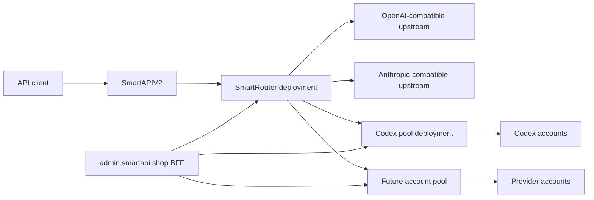

# SmartRouter v1 Specification

Status: Draft
Owner: SmartAPI
Implementation repository: `SmartCLIProxy`

Agent implementation roadmap:
`docs/smart-router-implementation-plan.md`

## 1. Purpose

SmartRouter is the internal model-routing layer between SmartAPIV2 and provider
upstreams. It maps each public model to an ordered group of upstream routes,
converts supported API protocols, performs safe failover, and reports normalized
usage.

SmartRouter does not manage individual subscription accounts. Account selection,
OAuth refresh, account quota polling, account cooldown, and account-level
failover belong to account-pool services such as the Codex pool.

The first version is implemented in the existing `SmartCLIProxy` repository and
is deployed as a separate runtime instance.

## 2. Goals

- Route every SmartAPIV2 inference request through one internal router.
- Maintain a generic registry of OpenAI- and Anthropic-compatible upstreams.
- Define a model as a group of independently configurable upstream routes.
- Support priority, weight, health state, cooldown, and failover per route.
- Keep account credentials and account-level routing inside account pools.
- Preserve Chat Completions, Responses, Anthropic Messages, and Images APIs.
- Normalize usage across protocols so SmartAPIV2 can bill correctly.
- Expose a narrow management API suitable for a schema-driven admin frontend.
- Run router and pool roles from the same Docker image without sharing runtime
  state or secrets.
- Preserve current SmartCLIProxy behavior unless a new service role is enabled.

## 3. Non-goals

- Moving SmartAPI user balances or API-key authentication into SmartRouter.
- Making SmartRouter aware of Codex, Grok, or OpenCode account credentials.
- Selecting an account inside an account pool.
- Estimating subscription quota cost or remaining image count.
- Automatically retrying an image after an ambiguous upstream failure.
- Executing client tool calls.
- Replacing SmartAPIV2 public model pricing or billing configuration.
- Requiring a separate VPS for each runtime role.
- Creating a second source copy of SmartCLIProxy under `SmartAPI/Pools`.

## 4. Terminology

- **Public model**: model identifier accepted by SmartAPIV2 clients.
- **Model group**: routing configuration for one public model.
- **Upstream**: independently managed API endpoint known to SmartRouter.
- **Route**: connection from a model group to one upstream and upstream model.
- **Account pool**: upstream service that selects provider accounts internally.
- **Attempt**: one request sent by SmartRouter to one route.
- **Protocol**: request and response wire format used by an upstream.
- **Capability**: supported operation such as text, image generation, vision, or
  tool calling.
- **Circuit breaker**: route health state used to suppress failing routes.

## 5. System boundaries



### 5.1 SmartAPIV2 owns

- Public API keys and user authentication.
- Balances, reservations, debits, pricing, and billing history.
- Public model catalogue and user-visible model metadata.
- Request history and three-day raw payload retention.
- Extraction and longer retention of prompt, usage, and request metadata.
- Public rate limits and maintenance mode.
- Removal of internal routing headers before returning responses to clients.

### 5.2 SmartRouter owns

- Upstream registry.
- Model groups and route membership.
- Public-model to upstream-model mapping.
- Route priority and weight.
- Route-level availability and circuit breakers.
- Protocol translation.
- Route-level failover.
- Normalized usage in the requested response protocol.
- Internal route diagnostics.

### 5.3 Account pools own

- Provider account credentials.
- OAuth and refresh-token lifecycle.
- Account quota polling.
- Account affinity.
- Account cooldown.
- Account-level failover.
- Safe account-management DTOs and operations.

SmartRouter treats an account pool exactly like any other API upstream.

## 6. Runtime roles

One SmartCLIProxy Docker image can run multiple independent deployments.

### 6.1 `router`

- Enables upstream registry and model-group routing.
- Does not load OAuth account files.
- Does not expose Codex account-management endpoints.
- Holds only upstream endpoint credentials.
- Receives inference traffic only from SmartAPIV2 or trusted internal callers.

### 6.2 `pool`

- Uses existing provider executors and credential selection.
- Owns provider account credentials and quota state.
- Exposes pool-specific management operations.
- Does not own cross-provider model groups.
- Is reachable only by SmartRouter and the admin BFF.

### 6.3 `combined`

- Preserves current SmartCLIProxy behavior for compatibility and development.
- Must not be used for the final SmartAPI production topology.
- Remains the default until existing deployments are explicitly migrated.

Proposed configuration:

```yaml
service-role: combined # combined | router | pool
pool-kind: ""          # codex | opencode | future provider; pool role only
```

Role validation must fail startup when incompatible configuration is present.
For example, `service-role: router` must reject local Codex OAuth credentials.

## 7. Supported API surfaces

SmartRouter v1 accepts:

- `POST /v1/chat/completions`
- `POST /v1/responses`
- `GET /v1/responses` for the existing Responses WebSocket behavior
- `POST /v1/responses/compact`
- `POST /v1/messages`
- `POST /v1/messages/count_tokens`
- `POST /v1/images/generations`
- `GET /v1/models`
- `GET /healthz`

Images edits and video endpoints are outside the initial SmartAPI routing
rollout even if the shared SmartCLIProxy runtime continues to support them.

The client-facing protocol is selected by the endpoint. A route may use another
upstream protocol when a registered translator supports the conversion.

## 8. Upstream registry

An upstream is configured once and reused by any number of model groups.

### 8.1 Network policy

Public HTTPS upstreams are allowed by default. HTTP and non-public network
targets require explicit router-level policy:

```yaml
network-policy:
  allow-http: true
  allowed-private-hosts:
    - codex-pool
  allowed-private-cidrs:
    - 172.16.0.0/12
  allowed-redirect-hosts: []
```

`allowed-private-hosts` contains exact DNS names without schemes, ports, IP
addresses, or wildcards. `allowed-private-cidrs` accepts only subnets of known
private, loopback, carrier-grade NAT, or link-local ranges. Runtime DNS answers
are checked before every request. Cross-origin redirects are rejected unless
the destination hostname is explicitly allowlisted; HTTPS-to-HTTP downgrades
remain forbidden.

### 8.2 Upstream fields

```yaml
id: codex-pool-eu
name: Codex pool EU
enabled: true
protocol: openai-responses
base-url: http://codex-pool:8317/v1
auth:
  type: bearer
  secret-ref: upstream/codex-pool-eu
headers:
  X-Internal-Caller: smart-router
capabilities:
  endpoints:
    - responses
    - chat-completions
  streaming: true
  tools: true
  vision-input: true
  image-generation: false
health-check:
  mode: http
  path: /healthz
  interval: 30s
  unhealthy-threshold: 3
  healthy-threshold: 2
trusted-pool: true
forward-smartapi-affinity: true
```

Required fields:

- `id`: stable lowercase identifier; immutable after creation.
- `name`: human-readable admin label.
- `enabled`: manual routing switch.
- `protocol`: upstream wire protocol.
- `base-url`: validated HTTP or HTTPS URL.
- `auth.type`: `none`, `bearer`, `api-key-header`, or `basic`.
- `auth.secret-ref`: reference to encrypted secret material.
- `capabilities`: allowlisted feature declarations.

Supported v1 protocols:

- `openai-responses`
- `openai-chat-completions`
- `anthropic-messages`

An OpenAI-compatible endpoint that supports both Chat Completions and Responses
may declare both endpoint capabilities. Protocol describes the preferred native
format, not the public format accepted by SmartRouter.

### 8.3 Secret handling

- Management responses never return secret values.
- A secret update is write-only.
- List and detail DTOs return only `configured: true|false` and `updated_at`.
- Secrets are encrypted at rest using an installation master key supplied via
  environment variable.
- Router startup fails in `router` role when the master key is missing.
- Secret values, Authorization headers, cookies, and raw credential files are
  redacted from logs and audit records.
- Deleting an upstream deletes its secret only after no model route references
  the upstream.

### 8.4 Dynamic upstream schemas

The management API returns an allowlisted schema for every upstream type. The
admin frontend renders fields from this schema instead of hardcoding provider
pages.

Adding another standard OpenAI- or Anthropic-compatible endpoint must require no
frontend deployment. A new wire protocol may require a backend adapter, but the
generic frontend remains unchanged.

## 9. Model groups

A model group represents one public model and contains one or more routes.

### 9.1 Model-group fields

```yaml
id: gpt-5-6-sol
public-model: gpt-5.6-sol
enabled: true
capability: text
selection:
  strategy: weighted-affinity
  affinity-ttl: 720h
routes:
  - id: codex-primary
    upstream-id: codex-pool-eu
    upstream-model: gpt-5.6-sol
    priority: 100
    weight: 80
    enabled: true
  - id: direct-openai
    upstream-id: openai-direct
    upstream-model: gpt-5.6-sol
    priority: 100
    weight: 20
    enabled: true
  - id: codex-backup
    upstream-id: codex-pool-backup
    upstream-model: gpt-5.6-sol
    priority: 50
    weight: 100
    enabled: true
```

Rules:

- `public-model` is unique.
- Higher `priority` wins.
- Only routes in the highest currently available priority tier participate.
- `weight` must be between 1 and 10,000.
- `upstream-model` is always explicit.
- A route can be disabled without deleting it.
- Upstream and route capabilities must satisfy the model-group capability.
- Configuration changes compile into a new immutable routing snapshot.
- Invalid changes are rejected without modifying the active snapshot.

### 9.2 Selection strategies

Supported v1 strategies:

- `weighted-round-robin`
- `weighted-affinity`

`weighted-affinity` is the recommended default for text models. It uses a stable
hash of the internal SmartAPI client fingerprint and route ID. If the selected
route is unavailable, the next ranked route is used without deleting the
affinity.

`weighted-round-robin` is appropriate for stateless direct upstreams.

Image groups default to `weighted-round-robin` because ambiguous image failures
cannot be freely retried.

## 10. Internal trust and affinity

SmartAPIV2 sends `X-SmartAPI-Affinity-Key`, a stable HMAC derived from the
client identity. It is not the raw public API key or user ID.

SmartRouter may use the fingerprint for route affinity and forwards it only to
trusted account-pool upstreams marked with both `trusted-pool: true` and
`forward-smartapi-affinity: true`. A direct external upstream cannot enable
internal affinity forwarding.

Untrusted direct upstreams never receive SmartAPI internal headers.

Other caller-supplied `X-SmartAPI-*`, `X-SmartCLI-*`, and `X-SmartRouter-*`
headers are rejected before any upstream attempt. Public responses from
SmartAPIV2 must not contain internal router diagnostics.

## 11. Routing lifecycle

For every request SmartRouter:

1. Authenticates the internal caller.
2. Parses the endpoint and requested public model.
3. Loads one immutable routing snapshot.
4. Validates model-group and endpoint capability.
5. Selects the highest available priority tier.
6. Orders routes using the configured selection strategy.
7. Translates the request into the route protocol.
8. Rewrites the public model to `upstream-model`.
9. Executes one attempt.
10. Classifies the result.
11. Returns success or safely tries the next route.
12. Translates the final response back to the requested protocol.
13. Emits route diagnostics and normalized usage.

One request uses one routing snapshot even if an admin changes configuration
while the request is running.

## 12. Failure classification and failover

Route-level failover and account-level failover are independent:

- A pool may try another account before returning an error to SmartRouter.
- SmartRouter may then try another route without knowing which accounts were
  attempted.

### 12.1 Text, non-streaming

| Result | Next route | Circuit effect |
| --- | --- | --- |
| `2xx` with valid body | No | Record success |
| `400`, `404`, `409`, `422` | No | None |
| `401`, `403` | Yes | Open configuration/auth circuit |
| `408` | Yes | Record transient failure |
| `429` | Yes | Cooldown using `Retry-After` or default |
| `500`, `502`, `503`, `504` | Yes | Record transient failure |
| Connect/network failure before response headers | Yes | Record transient failure |
| Malformed successful body | Yes once | Record protocol failure |
| Client cancellation | No | None |

Every route is attempted at most once per SmartRouter request.

### 12.2 Text, streaming

Failover is allowed only before SmartRouter commits the downstream response:

- upstream non-2xx before stream start;
- connection failure before response headers;
- malformed stream before the first semantic event.

After the first downstream semantic event or content byte, SmartRouter never
starts another route. It terminates the stream using the closest protocol error
representation and records a partial failure.

Keepalive comments and empty SSE lines do not commit the downstream response.

### 12.3 Images

Image failover is deliberately narrower:

| Result | Next route |
| --- | --- |
| `401`, `403`, `429` before a valid result | Yes |
| Validation error | No |
| Timeout or network failure | No |
| `5xx` | No |
| Malformed or oversized `2xx` body | No |
| Valid image response | No |

This prevents duplicate paid generations after an ambiguous upstream result.

## 13. Circuit breakers

Each route has an independent state:

- `closed`: normal traffic.
- `open`: excluded until `next_probe_at`.
- `half_open`: one bounded probe request is admitted.
- `disabled`: operator-disabled and never probed.

Default transitions:

- `401` or `403`: open until secret/configuration update or successful manual
  test.
- `429`: open until upstream `Retry-After`; otherwise 60 seconds.
- Three transient failures in 30 seconds: open for 30 seconds.
- Repeated transient opens use exponential cooldown capped at five minutes.
- One successful real request closes a transient circuit.
- Two successful active health checks mark transport health as healthy but do
  not override a model-specific `401`, `403`, or `429`.

Circuit state is runtime data. Manual `enabled` state is persistent
configuration. Quota percentages reported by an account pool do not directly
open a SmartRouter route; actual inference errors do.

## 14. Protocol conversion

SmartRouter reuses the existing SmartCLIProxy translator registry and executor
pipeline.

Required conversions for v1:

- Chat Completions to OpenAI Responses and back.
- Chat Completions to Anthropic Messages and back.
- OpenAI Responses to Anthropic Messages and back.
- Pass-through when source and target formats match.

The following request features must be preserved where the target protocol can
represent them:

- system and developer instructions;
- text and image input;
- tools, tool choice, and tool results;
- reasoning effort and thinking configuration;
- response format and structured output;
- stop conditions;
- maximum output tokens;
- service tier;
- streaming mode.

Unsupported lossy conversion must fail before sending an upstream request. It
must not silently drop a tool, image, or structured-output constraint.

The public model name is restored in the downstream response. The upstream model
name is available only in internal diagnostics.

## 15. Usage contract

Usage correctness is a release blocker because SmartAPIV2 bills from the
normalized response.

Canonical internal usage:

```json
{
  "input_tokens": 0,
  "output_tokens": 0,
  "cached_tokens": 0,
  "cache_read_tokens": 0,
  "cache_creation_tokens": 0,
  "reasoning_tokens": 0,
  "total_tokens": 0
}
```

Rules:

- Missing fields remain unknown internally; they are not inferred as billable
  tokens.
- `total_tokens` is calculated only when the protocol requires it and the
  component values are known.
- Cached tokens are also included in input tokens when that is the upstream
  protocol's documented meaning.
- Reasoning tokens remain a detail of output tokens unless the upstream defines
  them separately.
- SmartRouter never invents usage from text length when upstream usage exists.
- Any fallback token estimation must be explicitly marked `estimated: true` in
  internal diagnostics and is not enabled by default.

Downstream representations:

- Chat Completions: `usage.prompt_tokens`, `completion_tokens`,
  `prompt_tokens_details.cached_tokens`, and
  `completion_tokens_details.reasoning_tokens`.
- Responses: `usage.input_tokens`, `output_tokens`,
  `input_tokens_details.cached_tokens`, and
  `output_tokens_details.reasoning_tokens`.
- Anthropic Messages: `usage.input_tokens`, `output_tokens`,
  `cache_read_input_tokens`, and `cache_creation_input_tokens`.

Streaming requirements:

- Chat Completions must emit a final usage chunk even if the caller omitted
  `stream_options.include_usage`; the router may add this option upstream.
- Responses must include usage in `response.completed`.
- Anthropic Messages must include final usage in `message_delta`.
- A completed stream without usable final usage is marked
  `usage_missing=true` in diagnostics.

SmartCLIProxy already contains response-conversion tests for Responses input,
output, and cached-token usage. v1 adds a cross-protocol contract suite covering
all route directions, streaming, and non-streaming behavior.

## 16. Images

SmartRouter passes the validated image request to an image-capable route.

SmartAPIV2 remains responsible for:

- public `gpt-image-2` exposure;
- accepted request parameters;
- size normalization;
- fixed-token reservation and capture;
- response-size limits presented to the public client.

SmartRouter is responsible for:

- selecting only image-capable routes;
- rewriting the model;
- preserving `n`, quality, size, format, and response format;
- enforcing the image failover policy;
- recording the final route.

Image binary or base64 data must never be stored in SmartRouter request logs.

## 17. Management API

All endpoints are under `/v0/management/router` and use the existing management
authentication middleware. Generic `/api-call` is not exposed through the admin
BFF.

### 17.1 Schemas

- `GET /schemas/upstream-types`
- `GET /schemas/model-group`

### 17.2 Upstreams

- `GET /upstreams`
- `POST /upstreams`
- `GET /upstreams/:id`
- `PATCH /upstreams/:id`
- `DELETE /upstreams/:id`
- `POST /upstreams/:id/test`
- `POST /upstreams/:id/enable`
- `POST /upstreams/:id/disable`

Delete returns `409` while routes reference the upstream.

`test` performs a non-inference health/auth check whenever the upstream supports
one. A test that would consume inference must require an explicit
`allow_inference: true` flag and is not used by the default admin action.

### 17.3 Model groups

- `GET /model-groups`
- `POST /model-groups`
- `GET /model-groups/:id`
- `PATCH /model-groups/:id`
- `DELETE /model-groups/:id`
- `POST /model-groups/:id/routes`
- `PATCH /model-groups/:id/routes/:route_id`
- `DELETE /model-groups/:id/routes/:route_id`
- `POST /model-groups/:id/validate`

### 17.4 Runtime state

- `GET /state`
- `GET /routes/state`
- `GET /routes/:route_id/state`
- `POST /routes/:route_id/probe`
- `POST /routes/:route_id/circuit/reset`

Runtime DTOs may contain route IDs, upstream IDs, status, counters, latency,
last error category, and timestamps. They must not contain secret values or raw
upstream error bodies.

### 17.5 Concurrency

Mutable resources carry a monotonically increasing `revision`. `PATCH` and
`DELETE` require `If-Match` or an equivalent revision field. Conflicting updates
return `409` and do not overwrite newer configuration.

## 18. Persistence and reload

v1 uses two storage classes:

- versioned router metadata for upstreams, model groups, and routes;
- encrypted secret storage referenced by `secret-ref`.

The storage implementation must support:

- atomic metadata update;
- optimistic revision checks;
- crash-safe writes;
- immutable in-memory routing snapshots;
- backup without plaintext secrets;
- future PostgreSQL implementation behind an interface.

A successful management mutation:

1. validates the proposed complete state;
2. writes a new metadata revision atomically;
3. compiles a new routing snapshot;
4. swaps the active snapshot;
5. emits an audit event.

Failure at any step before the swap leaves the current routing snapshot active.

## 19. Admin application

The upstream and pool UI moves to `admin.smartapi.shop`.

The admin application contains:

- `Upstreams`: generic upstream registry and connection status.
- `Models`: model groups, route order, weight, and capability validation.
- `Account pools`: safe account/quota views supplied by pool adapters.
- `Traffic`: route counters, errors, latency, and recent failovers.
- `Audit`: configuration and operator actions.

The browser talks only to the admin BFF. The BFF:

- owns router and pool management URLs and keys in environment variables;
- enforces admin session, CSRF, and audit;
- validates responses through allowlisted DTOs;
- never sends management keys or credential material to the browser;
- can show stale read-only snapshots when a management service is unavailable.

The frontend renders upstream forms from management schemas. Adding a normal
OpenAI- or Anthropic-compatible upstream does not require rebuilding
SmartAPIV2.

## 20. Observability

Every SmartRouter request has a stable request ID.

Metrics:

- requests by public model, route, endpoint, and result;
- attempts and failovers;
- route selection count;
- upstream status classes;
- circuit state and transitions;
- latency and time to first token;
- streaming partial failures;
- usage-missing count;
- image ambiguous-failure count.

Internal diagnostic headers may include:

- `X-SmartRouter-Request-Id`
- `X-SmartRouter-Upstream`
- `X-SmartRouter-Route`
- `X-SmartRouter-Attempts`

SmartAPIV2 stores these for admin diagnostics and strips them from public
responses.

The authenticated router management API also exposes:

- `GET/PATCH /v0/management/router/network-policy`
- `GET /v0/management/router/metrics`
- route state with transport health, circuit transitions, safe timestamps,
  status classes, and counters

Logs never contain:

- public SmartAPI API keys;
- router management keys;
- upstream Authorization values;
- account AT, RT, ID tokens, cookies, or raw account IDs;
- image base64;
- unredacted raw upstream error bodies.

## 21. Security

- Router inference and management listeners are private-network only.
- Inference authentication and management authentication use different keys.
- Router and each pool use different management keys.
- Internal keys rotate independently.
- Upstream base URLs are validated against the allowed network policy to reduce
  SSRF risk.
- Redirects to another origin are rejected unless explicitly allowlisted.
- Custom headers use an allowlist and cannot override Host, Authorization,
  Content-Length, or SmartAPI internal headers.
- Admin actions produce actor, resource, action, revision, timestamp, and masked
  change summary.
- Secret reveal endpoints do not exist.

## 22. Deployment topology

The deployments may share one VPS and one private Docker network:

```yaml
services:
  smart-router:
    image: smart-cli-proxy:<version>
    environment:
      SERVICE_ROLE: router

  codex-pool:
    image: smart-cli-proxy:<version>
    environment:
      SERVICE_ROLE: pool
      POOL_KIND: codex
```

They use separate:

- containers;
- ports;
- configuration files;
- data volumes;
- secret master keys;
- management keys;
- health state.

SmartAPIV2 points all routed models to `smart-router`. SmartRouter points a Codex
route to `codex-pool`.

## 23. Compatibility and migration

No production behavior changes merely by deploying code containing SmartRouter.

Rollout:

1. Add role parsing with `combined` as the compatibility default.
2. Add router configuration types and validation behind a feature flag.
3. Add upstream registry and immutable snapshots.
4. Add model-group scheduler and route diagnostics.
5. Add route-level failover and circuit breakers.
6. Add management API.
7. Add cross-protocol usage contract tests.
8. Start `smart-router` on dev with fake upstreams.
9. Register the existing dev Codex SmartCLI instance as one upstream.
10. Point dev SmartAPIV2 models to SmartRouter.
11. Build and connect `admin.smartapi.shop`.
12. Run shadow and failure tests.
13. Prepare a separately approved production rollout.

Existing production services and traffic remain unchanged until an explicit
cutover approval.

## 24. Required tests

### 24.1 Configuration

- Invalid protocol, URL, capability, weight, and duplicate IDs.
- Route referencing a missing upstream; disabled upstreams remain valid but are
  excluded from selection.
- Atomic snapshot swap and failed-update rollback.
- Revision conflict.
- Role configuration incompatibility.
- Secret redaction in every DTO and error.

### 24.2 Selection

- Higher priority wins.
- Weight distribution within a tier.
- Stable weighted affinity.
- Disabled and open routes are skipped.
- Affinity falls through and returns after recovery.
- One snapshot is used throughout a request.

### 24.3 Failover

- Each status in the retry matrix.
- No route attempted twice.
- No retry after first streaming semantic event.
- Keepalive does not prevent pre-stream failover.
- No image retry after network, timeout, `5xx`, malformed body, or oversized
  response.
- Pool account failover followed by route failover.

### 24.4 Translation

- Chat Completions, Responses, and Anthropic request/response matrix.
- Tools and tool results.
- Structured output.
- Vision input.
- Reasoning effort.
- Public model restoration.
- Explicit rejection of unsupported lossy conversion.

### 24.5 Usage

- Streaming and non-streaming usage for every protocol direction.
- Input, output, cached, cache creation, cache read, and reasoning tokens.
- Responses `response.completed` usage.
- Chat final usage chunk.
- Anthropic final `message_delta` usage.
- Missing and malformed usage diagnostics.
- No double counting across failed attempts.

### 24.6 Security

- Browser responses contain no management or upstream secrets.
- Logs contain no Authorization, account tokens, cookies, or image base64.
- Internal affinity headers are rejected from untrusted callers.
- Internal headers are not forwarded to untrusted upstreams.
- SSRF and redirect protections.

## 25. Acceptance criteria

SmartRouter v1 is ready for dev integration when:

- One SmartAPIV2 provider points to SmartRouter.
- At least one model group contains two heterogeneous upstream routes.
- Forced failure of the primary produces a successful safe failover.
- Streaming never duplicates content during failover.
- Responses usage reaches SmartAPIV2 with correct token details.
- Codex account fingerprints remain managed only by the Codex pool.
- Disabling one Codex account changes pool behavior without changing the
  SmartRouter model group.
- Adding a generic OpenAI-compatible upstream requires no SmartAPIV2 rebuild.
- Admin DTOs and logs pass secret-scanning tests.

## 26. Decisions fixed by this draft

- One source repository and Docker image, separate router and pool deployments.
- SmartRouter does not manage provider accounts.
- Upstreams are registered independently from model groups.
- Model routes use explicit priority, weight, and upstream model mapping.
- Higher numeric priority wins.
- Route and account failover are separate layers.
- Images use a stricter failover policy than text.
- SmartAPIV2 remains the billing source of truth.
- The new admin application is separate from SmartAPIV2.
- Current combined SmartCLI behavior remains compatible during migration.
